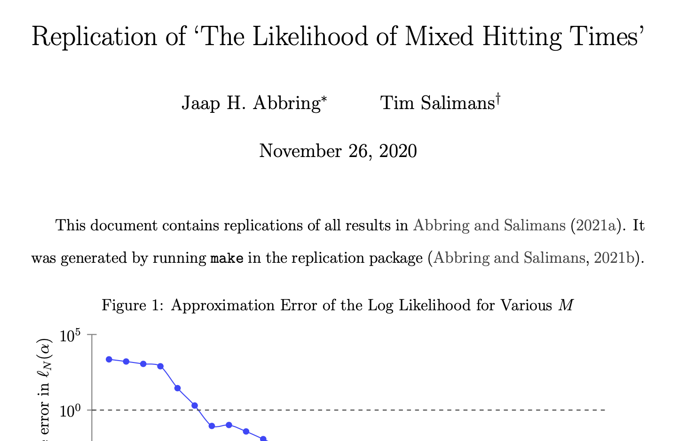

# The Likelihood of Mixed Hitting Times: Replication Package

This repository contains MATLAB code for replicating the numerical results in [Abbring and Salimans (2021)](https://arxiv.org/abs/1905.03463). This covers the computation of the likelihood of the [mixed hitting-time model](http://jaap.abbring.org/images/pdf/ecta7312.pdf), maximum likelihood estimation of parametric versions of this model, and an application to the analysis of [Kennan's (1985) strike data](https://www.ssc.wisc.edu/~jkennan/research/JEM85.pdf)

## Contents

The results in [Abbring and Salimans (2021)](https://arxiv.org/abs/1905.03463) were obtained by running `make` on a Macbook Pro (2018, 15inch) 2.9GHz 6-Core Intel Core i9 with macOS 10.15.7, MATLAB 2020b (with its Optimization Toolbox), and pdfTeX 3.14159265-2.6-1.40.19. This runs the following MATLAB scripts

- `figure1.m` -  replicates Figure 1
- `figure2.m` -  replicates Figure 2
- `figure3.m` -  replicates Figure 3
- `table1.m` - replicates Table 1
- `figure4.m` - replicates Figure 4
- `checkgradient.m` - checks the analytic gradients against numerical ones
<!-- - `table1BM.m` - recalculates Columns I-V of table one using the exact likelihood for the Gaussian case-->
- `table1lowM` - recalculates Table 1 with a lower value of the design parameter `M`

and displays the resulting figures and tables in a pdf file `replication.pdf`.

As an extra check, the scripts for computing Figures 1 and 2 can be adapted, by changing `dispplot=false` into `dispplot=true`, to plot these figures directly. This uses the following functions:
- `llhplot.m` - called from `figure1.m` if `dispplot=true` (default: `false`)
- `scatterplot.m` - called from `figure2.m` if `dispplot=true` (default: `false`)

The repository also contains a script

- `simtest.m` - simulates data and estimates the model on these data

Users can adapt these scripts to apply the procedures they call in other contexts. The scripts require a range of functions and a data set.

### 1. Model specification

The procedures require parametric specifications `<heter>` of the unobserved heterogeneity specification and `<shocks>` of the jumps in the latent Lévy process. The calculation of the Laplace transform of the mixed survival function for each such specification is coded up as a function `<heter><shocks>` in a file `<heter><shocks>.m`:

- `pointpoint.m` - Discrete heterogeneity and discrete shocks at Poisson times
- `pointgamma.m` - Discrete heterogeneity and gamma shocks at Poisson times
- `gammapoint.m` - Gamma heterogeneity and discrete shocks at Poisson times
- `gammagamma.m` - Gamma heterogeneity and gamma shocks at Poisson times

Users can extend the set of specifications by adding different functions `<heter><shocks>`.

### 2. Probability densities and cumulate distributions

- `numinvlap.m` - MHT pdf (calculated by Laplace transform inversion)
- `numinvlap2.m` - idem, but with input of design parameter `M`
- `igausscdf.m` - inverse Gaussian cdf
- `igausspdf.m` - inverse Gaussian pdf
- `weibullcdf.m` - Weibull MPH cdf
- `weibullpdf.m` - Weibull MPH pdf

### 3. Likelihood calculation

- `mhtobj.m` - minus the log likelihood of the MHT model (calculated by Laplace transform inversion)
- `lhmigauss.m` - likelihood of the MHT model (calculated using explicit expressions for the Gaussian case)
- `nllhmigauss.m` - minus the log likelihood of the MHT model (calculated using explicit expressions for the Gaussian case)
- `nllhmph.m` - minus the log likelihood of the Weibull MPH model

### 4. Maximum likelihood estimation

- `mhtmle.m` - ML estimation of the general MHT model (based on Laplace inversion)
- `migaussmle.m` - ML estimation of the Gaussian special case

### 5. Simulation

- `randraw.m` -  efficient random number generator (by Alex Bar Guy and Alexander Podgaetsky)
- `simmht.m` - simulates durations from mixed hitting time model

### 6. Data

- `strdur.asc` - Fixed format text file with [Kennan's (1985) strike data](https://www.ssc.wisc.edu/~jkennan/research/JEM85.pdf) (source: [Cameron and Trivedi’s, 2005, data sets page](http://cameron.econ.ucdavis.edu/mmabook/mmadata.html)).

## References
- Abbring, Jaap H., and Tim Salimans (2021), “[The likelihood of mixed hitting times](https://arxiv.org/abs/1905.03463)”, *Journal of Econometrics*, forthcoming. arXiv:1905.03463 \[econ.EM\].
- Cameron, A. Colin, and Pravin K. Trivedi (2005), *[Microeconometrics: Methods and Applications](http://cameron.econ.ucdavis.edu/mmabook/mma.html)*, Cambridge: Cambridge University Press.
- Kennan, John (1985), "[The duration of contract strikes in U.S. manufacturing](https://www.ssc.wisc.edu/~jkennan/research/JEM85.pdf)", *Journal of Econometrics*, 28, 5–28.

We welcome the use of this software under an [MIT license](https://github.com/jabbring/mht-likelihood/blob/master/LICENSE).

&copy; 2020 Jaap H. Abbring and Tim Salimans
